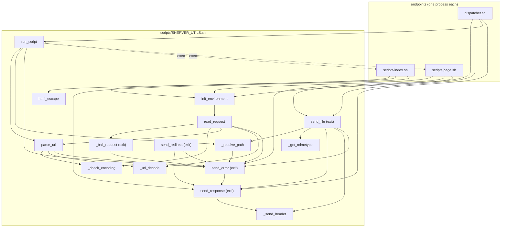

Call graph
==========

Who calls what, from the listening socket down to the library functions. The functions are
documented in [docs/functions.md](./functions.md) and the exported variables in
[docs/global-variables.md](./global-variables.md); this file only maps the edges. It is maintained by
hand: update it when a call is added or removed, not for doc-only changes.

Processes
---------

```
sherver.sh ──exec──> socat ──fork+exec (per connection)──> dispatcher.sh
                                                               │ source scripts/SHERVER_UTILS.sh
                                                               │ init_environment
                                                               ├─ method OPTIONS     ──> send_response 200
                                                               ├─ /file/*            ──> send_file
                                                               ├─ / or /index.htm[l] ──> run_script '/index.sh'
                                                               └─ anything else      ──> run_script "$REQUEST_URL"
```

`run_script` `cd`s into `scripts/` and executes the resolved endpoint as a **new process**
(`index.sh`, `page.sh`, ...). A Bash endpoint starts by calling `init_environment` again, which
re-parses the request from the exported `REQUEST_FULL_STRING` instead of stdin.

Function graph
--------------

Two kinds of edges are left out to keep the graph readable: everything may call `log` and
`log_debug`, and everything that sets a response header does it through `add_header`. Functions
marked `exit` are terminal: they write the response and end the process, so nothing after them
runs — including in their callers.



The same edges as a table, with the process boundaries spelled out:

| Caller             | Calls                                                                           |
| ------------------ | ------------------------------------------------------------------------------- |
| `sherver.sh`       | `socat` (exec: socat becomes the listener)                                      |
| `dispatcher.sh`    | `init_environment`, then `send_response` (OPTIONS), `send_file` or `run_script` |
| `init_environment` | `read_request`                                                                  |
| `read_request`     | `_bail_request`, `_check_encoding`, `parse_url`, `_url_decode`, `send_error`    |
| `_bail_request`    | `send_error`                                                                    |
| `parse_url`        | `_check_encoding`, `_url_decode`, `send_error`                                  |
| `run_script`       | `parse_url`, `_resolve_path`, `send_error`, the endpoint (exec)                 |
| `send_file`        | `_resolve_path`, `_get_mimetype`, `send_response`, `_send_header`, `send_error` |
| `_resolve_path`    | `send_error`                                                                    |
| `send_error`       | `send_response`                                                                 |
| `send_redirect`    | `send_response`, `send_error`                                                   |
| `send_response`    | `_send_header`                                                                  |
| `scripts/index.sh` | `init_environment`, `html_escape`, `send_response`                              |
| `scripts/page.sh`  | `init_environment`, `send_error`, `send_file`                                   |

`send_file` answers a 304 through `send_response`, but streams the body itself: `_send_header` then
`cat` for a 200, or `tail -c | head -c` for a 206. `_send_header` writes the status line, the headers
and the one access log line per request.

Leaf functions (nothing below them but `log`/`log_debug`): `_check_encoding`, `_url_decode`,
`html_escape`, `add_header`, `_get_mimetype`, `_send_header`.

Error codes
-----------

Which function sends which code through `send_error` (`read_request` routes its early parse
failures through `_bail_request`, which owns the dump-and-log convention):

| Function           | Codes                             | Sent when                                                 |
| ------------------ | --------------------------------- | --------------------------------------------------------- |
| `read_request`     | 400, 405, 413, 414, 431, 501, 505 | bad request line, header or body; method; version; limits |
| `parse_url`        | 400                               | invalid percent encoding                                  |
| `_resolve_path`    | 404, 500                          | path missing or escaping the tree — never 403             |
| `run_script`       | 404, 500                          | endpoint not executable, or it exited non-zero            |
| `send_file`        | 404, 416                          | not a readable regular file; unsatisfiable `Range`        |
| `send_redirect`    | 500                               | no target, a CR or LF in it, or non-redirect code         |
| `scripts/page.sh`  | 404, 405                          | missing `page` parameter; method not GET or HEAD          |

External commands
-----------------

| Command    | Called from                                                  |
| ---------- | ------------------------------------------------------------ |
| `socat`    | `sherver.sh`                                                 |
| `realpath` | `init_environment` (`SHERVER_ROOT`), `_resolve_path`         |
| `stat`     | `send_file` (ETag, `Last-Modified`, `Content-Length`)        |
| `date`     | `_send_header`                                               |
| `cat`      | `send_file` (body), heredocs in `send_error` and `index.sh`  |
| `tail`     | `send_file` (a range answer, piped into `head`)              |
| `head`     | `send_file` (a range answer)                                 |
| `envsubst` | `index.sh`                                                   |
